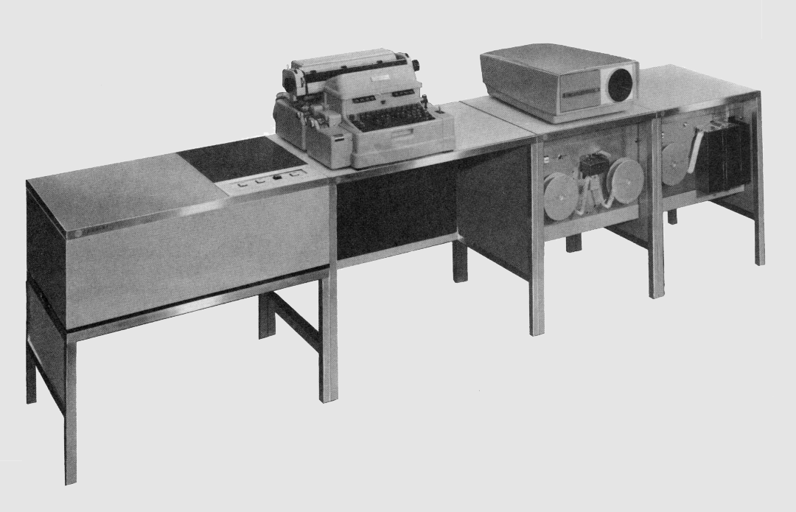

# retro-lgp21 Emulator

A web-based emulator for the General Precision LGP-21 computer system.

The General Precision LGP-21 was a binary, transistorized, disk-memory computer system released in 1963. It was designed as a cost-reduced follow-on to the well-known LGP-30, a mid-1950s vacuum-tube, drum-memory system.

The LGP-21 had the same instruction set as the LGP-30, plus a few additional instruction variants, but the input/output instructions worked differently; thus an LGP-30 program would require changes in that area in order to run on the LGP-21.

Instead of a memory drum, the LGP-21 used a single-platter disk with fixed heads, rotating at 1125 RPM. The disk had 32 tracks of 128 words, yielding a total of 4096 words of memory. Registers for the accumulator, current instruction word, program counter, and a double-precision register used with multiply and divide were also on the disk as re-circulating delay lines.

Perhaps to reduce cost, the LGP-21 had fewer heads than the LGP-30, which had 64 tracks of 64 words each on its drum, for the same 4096 words. To keep software between the two systems more compatible, the words of two 64-word LGP-30 tracks were interleaved onto one physical 128-word LGP-21 track, but the interleaving was done in a way that allowed programmers to continue to think in terms of 64 tracks of 64 words without significantly affecting LGP-30-based timing optimizations for disk rotational latency.

All systems had a Flexowriter, a heavy-duty electric typewriter with an integrated paper-tape reader and punch. The Flexowriter typed, read, and punched at 10 characters per second. Higher-speed paper-tape devices manufactured by Tally Systems, were available as an option, but many LGP-2s had only the Flexowriter. Additional peripheral devices were possible, but required the development of customer interface boards, and were not offered by General Precision.

One interesting feature that was carried over from the LGP-30 was the use of an oscilloscope to display the major registers: C (program counter), R (current instruction word), and A (accumulator). The values of these registers were displayed as square waves on the 'scope. The horizontal lines were drawn in either an up or down position, with _up_ designating a 1 bit and _down_ a 0 bit. A reticule immediately in front of the 'scope tube had gradations and legends to allow the bits and fields in a word to be identified. The LGP-21 'scope was an optional, extra-cost option housed in a separate unit, but its display was larger than the one built into the the LGP-30.

Like the LGP-30, the LGP-21 had a 32-bit word and used twos-complement arithmetic. Also like the LGP-30, the low-order bit of a word (termed the "spacer bit") was always zero in memory. That bit was present in the accumulator, however, participated in arithmetic operations, and was loaded during input from peripheral devices. This led to some interesting programming considerations.

The LGP-21 was a very small and inexpensive computer system for its time. It had a base price of about $17K in 1963 dollars, less the Flexowriter, which was another $5500. The CPU logic and memory disk were housed in a unit about the size of a living-room end table. The higher-speed paper-tape units were in cabinets of the same size and style as the logic and disk unit.

Despite its low price, it was not particularly successful in the U.S. With a slower disk and longer track lengths than the LGP-30, the LGP-21 had an effective clock rate of 76.8 Hz and ran at about one-third the speed. Schoppe & Faeser in Germany, who was licensed to manufacture the system, and took some liberties with the disk speed and packaging, appears to have had more success. Regardless, 1963 was probably just too late to be introducing a computer with a rotating main memory. Apparently a total of only about 100 systems were built.

The primary goals of this project are creation of a web browser-based emulator for the LGP-21 and recovery of as much software for the system as we are able to find. The emulator is designed to run at the speed of a real LGP-21. The user interface is designed to reproduce the way a person would have interacted with the system and its peripheral devices.

The contents of this project are licensed under the [MIT License](http://www.opensource.org/licenses/mit-license.php).

| Related Sites | URL |
| ------------- | ----- |
| Emulator hosting site | http://www.phkimpel.us/LGP-21/ |
| Source code repository | https://github.com/pkimpel/retro-lgp21/ |
| Project Wiki | https://github.com/pkimpel/retro-lgp21/wiki/ |
| Project Blog | https://retro-emulation.blogspot.com/ |
| LGP-21 Documents at bitsavers | http://bitsavers.org/pdf/generalPrecision/LGP-21/ |
| Tom Jenning's LGP-21 site | https://www.sensitiveresearch.com/Archive/LGP-21/index.html |
| Jürgen Müller's LGP-21 site | https://www.e-basteln.de/computing/lgp21/lgp21/ |
| LGP-21 at Technikum29 | https://www.technikum29.de/de/rechnertechnik/lgp21/ |
| LGP-30 Wikipedia page | https://en.wikipedia.org/wiki/LGP-30 |
